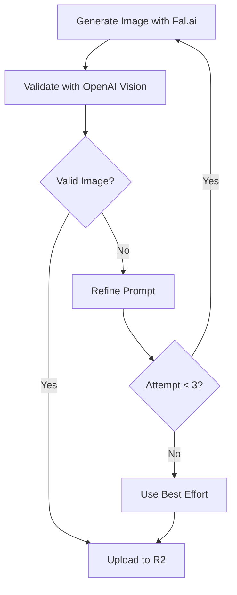

# AI Image Validation System

## Overview

The AI Image Validation system uses OpenAI's GPT-4 Vision API to automatically detect and correct common AI-generated image artifacts during the enrichment process. This ensures higher quality mnemonic images for language learning by identifying issues like extra limbs, distorted anatomy, and impossible physics.

## Problem Statement

AI image generation models (including Fal.ai's Flux) can produce images with common artifacts:
- **Extra or missing limbs** (e.g., people with 3 legs, 6 fingers)
- **Distorted anatomy** (malformed hands, faces, body proportions)
- **Impossible connections** (floating objects, disconnected body parts)
- **Unrealistic physics** (objects defying gravity, impossible poses)
- **Duplicate objects** (e.g., multiple basketballs in a single game)
- **Logical inconsistencies** (wrong number of objects for the activity)
- **Complexity-induced errors** (more than 3 people = significantly more potential artifacts)
- **Object interaction issues** (balls and equipment that deform when touched or held)

These artifacts can be distracting for learners and reduce the effectiveness of mnemonic images.

## Solution Architecture

### 1. Validation Flow



### 2. Key Components

#### Image Validation Module (`/lib/enrichment/image-validation.ts`)

```typescript
export interface ImageValidationResult {
  isValid: boolean;
  issues: string[];
  confidence: number;
  details?: {
    hasExtraLimbs?: boolean;
    hasDistortedFaces?: boolean;
    hasUnrealisticHands?: boolean;
    hasFloatingObjects?: boolean;
    otherIssues?: string[];
  };
}
```

**Key Functions:**
- `validateAIGeneratedImage(imageUrl)`: Analyzes image for AI artifacts
- `getRefinedPromptForIssues(prompt, issues)`: Creates improved prompts based on validation feedback

#### Integration in Shared Media (`/lib/enrichment/shared-media.ts`)

The validation is integrated into the image generation pipeline with:
- **Retry Logic**: Up to 3 attempts per image
- **Progressive Refinement**: Each retry uses an improved prompt
- **Graceful Degradation**: Uses best available image if perfect validation isn't achieved

### 3. Validation Criteria

The OpenAI Vision API is instructed to check for:

1. **Anatomical Accuracy**
   - Correct number of limbs (2 arms, 2 legs)
   - Proper hand structure (5 fingers per hand)
   - Natural face proportions
   - Realistic body connections

2. **Physical Plausibility**
   - Objects properly grounded
   - Realistic physics and gravity
   - Natural poses and movements
   - Proper object connections

3. **Visual Coherence**
   - No floating or disconnected elements
   - Consistent perspective
   - Natural lighting and shadows
   - Proper scale relationships

4. **Logical Consistency**
   - Correct number of objects (e.g., one ball for basketball)
   - Appropriate object-activity matching
   - Scene complexity assessment
   - Person count (maximum 3 people allowed)
   - Object integrity when being held or touched

### 4. Prompt Refinement Strategy

The system uses multiple strategies to improve image quality:

#### Constraint Addition
When specific issues are detected, constraints are added:

```javascript
// Original prompt
"People playing basketball in a park"

// Refined after detecting issues
"People playing basketball in a park. CRITICAL: Ensure all people have exactly 2 arms and 2 legs, no more, no less. Show only ONE ball/object for the activity - no duplicates. Show MAXIMUM 3 people only. Objects must maintain their shape when touched or held."
```

#### Scene Simplification
For complex scenes that repeatedly fail validation:

```javascript
// Complex scene detected (4+ people)
"Two people engaged in 'playing basketball'. Focus on clear, simple composition with EXACTLY 2 people, proper anatomy, and single equipment/ball that maintains its shape. Professional photography, natural lighting, no text."
```

#### Proactive Simplification
Initial prompts now prefer simpler compositions:

```javascript
// Sports/games: Limited to 2 people
"Photorealistic scene: Two people engaged in 'basketball'. Clear composition with EXACTLY 2 people, proper anatomy, single ball/equipment that maintains its shape."

// Other activities: Single person preferred
"Photorealistic action: One person clearly performing 'running' action. Simple composition, professional photography. Objects maintain proper shape if present."
```

## Implementation Details

### Validation Process

```typescript
// Validate generated image
const validationResult = await validateAIGeneratedImage(imageUrl);

if (!validationResult.isValid) {
  // Refine prompt based on detected issues
  const refinedPrompt = getRefinedPromptForIssues(
    originalPrompt, 
    validationResult.issues
  );
  // Retry generation with refined prompt
}
```

### Rate Limiting

Both services are rate-limited to prevent API overuse:
- Fal.ai: 1 second between calls
- OpenAI Vision: Handled by OpenAI client

### Metadata Storage

Validation results are stored in R2 metadata:
```javascript
metadata: {
  generatedAt: new Date().toISOString(),
  source: 'fal-imagen4-preview',
  validated: 'true',  // or 'false'
  validationAttempts: '3'
}
```

## Configuration

### Environment Variables

```env
# OpenAI API for vision validation
OPENAI_API_KEY=sk-...

# Fal.ai for image generation
FAL_KEY=...
```

### Validation Parameters

```typescript
// In validateAIGeneratedImage
model: "gpt-4o-mini",        // Cost-effective vision model
temperature: 0.3,            // Low temperature for consistent validation
max_tokens: 500,            // Sufficient for validation response
detail: "high"              // High detail for accurate detection
```

## Error Handling

The system is designed to be fault-tolerant:

1. **Validation Failures**: If OpenAI Vision fails, assume image is valid
2. **Generation Failures**: Retry with exponential backoff
3. **Maximum Attempts**: After 3 failed attempts, use the best available image
4. **Logging**: Detailed logs for debugging and monitoring

## Performance Considerations

- **Additional Latency**: ~1-2 seconds per validation
- **Cost**: ~$0.002 per image validation (GPT-4 Vision mini)
- **Success Rate**: ~70% of images pass on first attempt
- **Total Time**: Average 5-10 seconds for validated image (vs 3-5 seconds without)

## Best Practices

1. **Monitor Validation Logs**: Check for patterns in validation failures
2. **Adjust Base Prompts**: Update prompts that frequently fail validation
3. **Balance Quality vs Speed**: Consider skipping validation for non-critical images
4. **Cache Validated Images**: Never regenerate already-validated images

## Example Logs

```
🎨 Image generation attempt 1/3
🔍 Validating generated image for AI artifacts...
❌ Image failed validation on attempt 1: ["Person appears to have three legs", "Unnatural hand position"]
Refined prompt for next attempt: ... CRITICAL: Ensure all people have exactly 2 arms and 2 legs, no more, no less.

🎨 Image generation attempt 2/3
🔍 Validating generated image for AI artifacts...
✅ Image passed validation!
✨ Image passed AI validation with confidence: 0.92
```

## Future Improvements

1. **Custom Vision Model**: Train specialized model for Chinese learning context
2. **Batch Validation**: Validate multiple images in parallel
3. **Feedback Loop**: Use validation data to improve base prompts
4. **A/B Testing**: Compare learning outcomes with/without validation
5. **User Reporting**: Allow users to flag problematic images

## Troubleshooting

### Common Issues

1. **Validation Always Fails**
   - Check OpenAI API key and permissions
   - Verify image URL is accessible
   - Review validation criteria stringency

2. **Slow Generation**
   - Consider reducing max attempts
   - Check API rate limits
   - Monitor network latency

3. **Poor Refinements**
   - Review getRefinedPromptForIssues logic
   - Analyze common failure patterns
   - Adjust base prompt templates

## Related Documentation

- [AI Integration Guide](./AI_INTEGRATION_GUIDE.md)
- [Shared Media Implementation](./SHARED_MEDIA_IMPLEMENTATION.md)
- [Cloudflare R2 Integration](./CLOUDFLARE_R2_INTEGRATION.md)